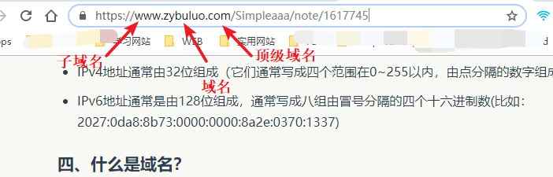

# PRE-M03-L01 初始计算机网络

## 简述客户端和服务端的作用

    客户端主要作用是访问、获取服务端的信息，服务端的主要作用是用于存储信息、提供信息给客户端进行访问，

## IP地址的作用
    IP地址主要是用于给互联网中的每一台计算机分配全网一个唯一的地址，使得互联网中不同的区域的计算机可以更好的进行通信
    目前IP地址主要使用的是IPv4的地址，还有IPv6地址。

## 域名的作用
    域名可以理解成是给IP地址加了一个便于人们记住的别名，对于IP地址，32位的数字通常不太方便人们记忆，而域名就相当于是给IP地址    
    取了一个易于记忆的别名，访问一个域名的时候，会先经过DNS服务去解析域名，查找到对应的IP地址，然后再去和这个IP进行通信
    例如百度网站的域名是www.baidu.com，可以通过 https://www.baidu.com 访问到百度网站，也可以直接在浏览器输入14.215.177.39    
    来访问百度网站

## 域名各部分的组成

## URL的作用
    URL相当于是给互联网中的每一个资源的一个唯一的身份证，一个访问的链接，通过URL可以链接到指定的资源

## URL各部分的含义

## FTP、SMTP、IMAP、IRC、HTTP协议的作用
- FTP协议：file transfer protocol，文件传输协议，用于在互联网进行文件传输的协议
- SMTP协议：simple mail transfer protocol，简单邮件传输协议，用于在互联网上进行邮件传输
- IMAP协议：Internet message access protocol，因特网信息访问协议，用于向远程服务器上访问、获取邮件信息的协议
- IRC协议：Internet relay chat，因特网中继聊天协议，用于全体聊天的协议
- HTTP协议：hyper text transfer protocol，超文本传输协议