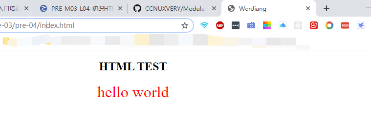
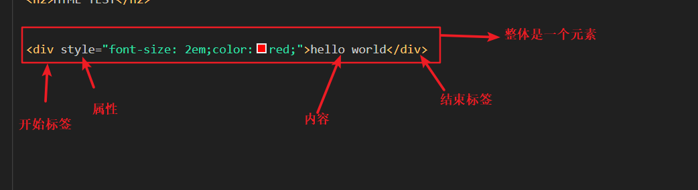

# P1-M01-L04 初始HTML

## HTML
    HTML，Hyper Text Markup Language，超文本标记语言，是一种标记语言，用于描述网页中的内容的语义    
    HTML主要是通过标签tag 进行标记，对网页中的内容进行语义化     
    h1--h6标签用于标记网页的标题，p标签用于标记段落，img标签用于标记图片......

## 编写index.HTML文档
```
<!DOCTYPE html>
<html lang="en">

<head>
  <meta charset="UTF-8">
  <meta name="viewport" content="width=device-width, initial-scale=1.0">
  <meta http-equiv="X-UA-Compatible" content="ie=edge">
  <title>WenJiang</title>
</head>

<body>
  <div style="text-align: center;">
    <h2>HTML TEST</h2>
    <div style="font-size: 2em;color:red;">hello world</div>
  </div>
</body>

</html>
```




## 写一个HTML标签
```
<div style="font-size: 2em;color:red;">hello world</div>
```
