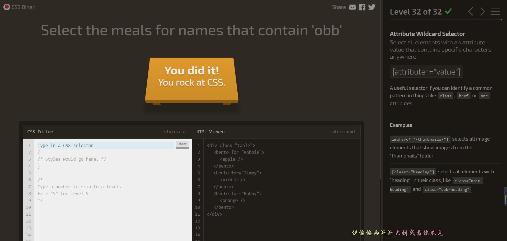
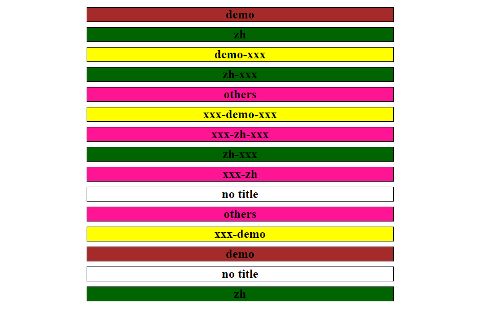

## Part01-Module02-L02 CSS选择器
## Hello World文檔
    HTML源代碼位於L-02目錄下的hello.html文件，css源代碼位於hello.css文件中
```css
#p-id {
    font-size: 2em;
    font-weight: 600;
    text-align: center;
    color: red;
}

.p-class {
    font-weight: 600;
    text-align: center;
    color: red;
}

.container p {
    font-weight: 600;
    text-align: center;
    color: red;
}
```

## 網站練習


## DIV
    源代碼位於L-02目錄下的div.html和div.css 文件中，選中不同的div的時候，會設置相應的div的背景顔色用以區分
```css
/* 帶有title的div,背景為粉色 */

div[title] {
  background-color: deeppink;
}

/* title包含demo的div，背景為黃色 */

div[title*=demo] {
  background-color: yellow;
}

/* title為demo的div，背景為棕色 */

/* 把title為demo的樣式放在title包含demo的後面，否則title包含demo的樣式會覆蓋title=demo的樣式 */

div[title=demo] {
  background-color: brown;
}

/* title=zh或者是title以zh開頭的div，背景為綠色 */

div[title=zh], div[title^=zh] {
  background-color: darkgreen;
}
```
