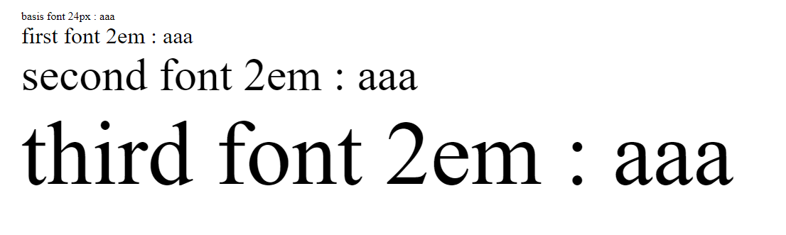

# Part01-Module02-L03 CSS样式

## CSS字体相关知识点总结
- 五种通用字体     
  - Serif
  - Sans-serif
  - Monospace
  - Cursive
  - Fantasy

  - 相关链接
    - [W3C](https://www.w3.org/Style/Examples/007/fonts.zh_CN.html)
    - [W3School](https://www.w3school.com.cn/css/css_font.asp)

- 多个字体的设置    
    `{ font-family:"Times New Roman",Times,serif; }`    
    使用font-family 属性来指定字体的系列，多个字体之间使用逗号分隔开，默认先加载最前面的字体，如果无法加载就往后加载    
    通常为了保证能按预期显示，在最后一个字体设置为css通用字体，在所有其他字体都不能显示的时候，就可以加载指定的通用字体

- px/em/rem单位的区别
  - px：绝对单位，像素单位，1px 等价于一个像素，具体像素的size会受到具体设备的参数影响
  - em：相对单位，应用在当前元素上的默认字体（继承自父元素）为 1em，通常是与字体的尺寸
  - rem：相对于根元素的尺寸单位，HTML文档的根元素是html节点
```
<div class="test" style="font-size: 16px;">
    basis font 24px : aaa
    <div class="aaa" style="font-size: 2em;">
      first font 2em : aaa
      <div class="bbb" style="font-size: 2em;">
          second font 2em : aaa
        <div class="ccc" style="font-size: 2em;">
            third font 2em : aaa
        </div>
      </div>
    </div>
</div>
```



## HTML文档
    HTML文档源代码位于L-03目录下的index.html 文件中
```
<!DOCTYPE html>
<html lang="en">

<head>
  <meta charset="UTF-8">
  <meta name="viewport" content="width=device-width, initial-scale=1.0">
  <meta http-equiv="X-UA-Compatible" content="ie=edge">
  <title>CSS STYLE</title>
  <style>
    body {
      display: flex;
      flex-direction: column;
      align-items: center;
    }

    p.normal {
      font-weight: 500;
      font-size: 2em;

    }

    p.caps {
      font-weight: 500;
      font-size: 2em;
      font-variant-caps: small-caps;
    }
  </style>
</head>

<body>
  <div class="root">
    <p class="normal">This is a paragraph.</p>
    <p class="caps">This is a paragraph.</p>
  </div>
</body>

</html>
```
