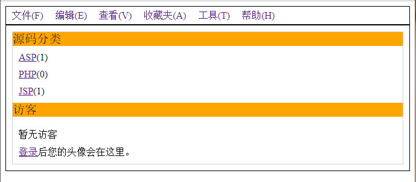
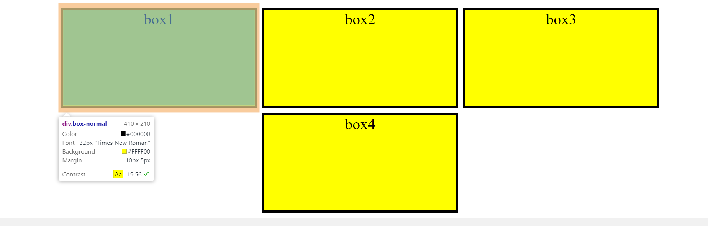

# Part01-Module02-L05 盒模型
## 探索margin折叠的意义

## BLOG页面实现
    HTML文档源代码位于L-05目录下的blog.html文件，样式文件位于blog.less文件（这里比较习惯写less，就写了less的文件）
```less
/*Global Variables*/
@OUT_BORDER: 1px solid black;
@INNER_BORDER: 1px solid lightgrey;
@ITEM_BACKGROUND: orange;
@LIST_ITEM_MARGIN: 10px;

/*Global Styles*/
html,
body {
  max-width: 100%;
}


ul {
  margin: 0;
  padding: 0;
  list-style-type: none;
}

.root {
  .header {
    border: @OUT_BORDER;

    .navigation-bar {
      display: flex;
      flex-direction: row;

      li {
        margin: 5px 10px;

        a {
          text-decoration: none;
        }
      }
    }

  }

  .main {
    border: @OUT_BORDER;

    &-container {
      margin: 10px;
      border: @INNER_BORDER;

      >* {
        display: flex;
        flex-direction: column;
      }

      .code-type {

        &-title {
          background-color: @ITEM_BACKGROUND;
          font-size: 20px;
        }

        &-list ul li {
          margin: @LIST_ITEM_MARGIN;
        }
      }

      .visitor {
        &-title {
          background-color: @ITEM_BACKGROUND;
          font-size: 20px;
        }

        &-list {
          margin: @LIST_ITEM_MARGIN;

          >* {
            margin-top: 10px;
          }
        }
      }
    }

  }

}
```
```html

<body>
  <div class="root">
    <div class="container">
      <div class="header">
        <ul class="navigation-bar">
          <li><a href="#">文件(F)</a></li>
          <li><a href="#">编辑(E)</a></li>
          <li><a href="#">查看(V)</a></li>
          <li><a href="#">收藏夹(A)</a></li>
          <li><a href="#">工具(T)</a></li>
          <li><a href="#">帮助(H)</a></li>
        </ul>
      </div>
      <div class="main">
        <div class="main-container">
          <div class="code-type">
            <div class="code-type-title">
              源码分类
            </div>
            <div class="code-type-list">
              <ul>
                <li><a href="#">ASP</a>(1)</li>
                <li><a href="#">PHP</a>(0)</li>
                <li><a href="#">JSP</a>(1)</li>
              </ul>
            </div>
          </div>
          <div class="visitor">
            <div class="visitor-title">
              访客
            </div>
            <div class="visitor-list">
              <div class="visitor-list-info">
                暂无访客
              </div>
              <div class="visitor-list-tips">
                <a href="#">登录</a>后您的头像会在这里。
              </div>
            </div>
          </div>
        </div>
      </div>
    </div>
  </div>

</body>

```


## BOX页面
    HTML文件位于L-05目录下的box.html文件中，对应的样式文件位于box.css文件中
```css
html, body {
  min-width: 100%;
  overflow-x: scroll;
}

.container {
  display: flex;
  flex-direction: row;
  justify-content: center;
  width: 100%;
  overflow-x: auto;
  /* margin: 0 20px; */
}

div.box-normal {
  flex: none;
  width: 400px !important;
  height: 200px;
  border: 5px solid black;
  margin: 10px 5px;
  text-align: center;
  color: black;
  font-size: 2em;
  background-color: yellow;
}
```

```html
<body>
  <div class="root">
    <div class="container">
      <div class="box-normal">box1</div>
      <div class="box-multi">
        <div class="box-normal">box2</div>
        <div class="box-normal">box4</div>
      </div>
      <div class="box-normal">box3</div>

    </div>
  </div>
</body>

```



## 图像页面
    HTML文件位于L-05目录下的img.html文件中，对应的样式文件位于img.css文件中     
    因为任务中没有给出图片的大小，以及margin-right也没有给出，因此图片没有限定大小，margin-right设置为auto
```css
html, body {
  width: 100%;
}

.root {
  display: flex;
  width: 100%;
  max-width: max-content;
  background-color: red;
}

.container {
  margin: 30px auto 30px 50px;
  max-width: 100%;
  overflow: hidden;
  background-color: yellow;
}

img {
  padding: 20px;
  max-width: 100%;
}
```

```html
<body>
  <div class="root">
    <div class="container">

        

        <!--  -->
    </div>
  </div>
</body>
```
