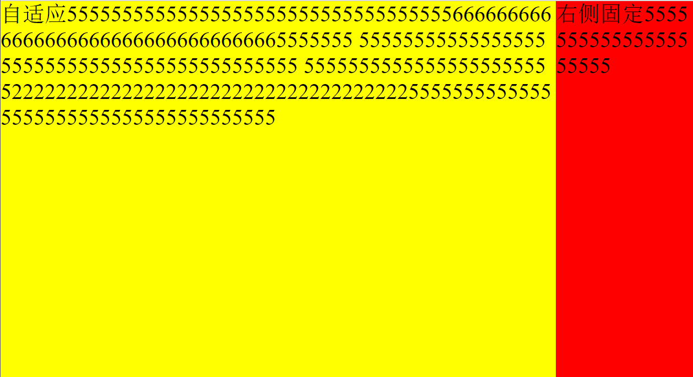
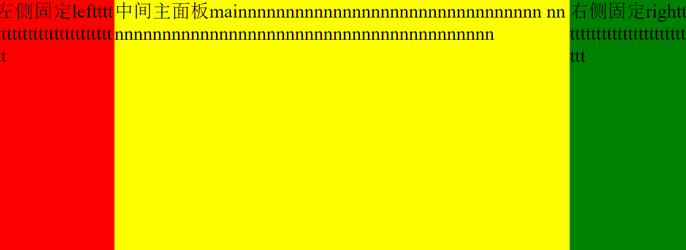

# Part01-Module02-L06 CSS布局
## 单行图片布局
    源代码位于L-06目录下的picture.html和picture.css文件中，因为margin具体值都没有给出，所以只是随便设了些值
```html
<body>
  <div class="root">
    <div class="container">
      <div class="img-item">
        <div class="img-item-pic">
          
        </div>
        <div class="img-item-title">翱翔天际</div>
      </div>
      <div class="img-item">
        <div class="img-item-pic">
          
        </div>
        <div class="img-item-title">绿草茵茵</div>
      </div>
      <div class="img-item">
        <div class="img-item-pic">
          
        </div>
        <div class="img-item-title">蓝天白云</div>
      </div>
      <div class="img-item">
        <didv class="img-item-pic">
          
        </didv>
        <div class="img-item-title">鲜花盛开</div>
      </div>
    </div>
  </div>

</body>
```

```css
html, body, .root {
    width: 100%;
    background-color: rgba(196, 221, 146, 0.993);
    margin: 0;
    padding: 0;
    /* overflow-x: hidden; */
}

.container {
    display: flex;
    flex-direction: row;
    justify-content: center;
    width: 100%;
    max-width: 100%;
    margin-top: 50px;
}

.img-item {
    flex: none;
    display: flex;
    flex-direction: column;
    justify-content: center;
    align-items: center;
    width: 20%;
    margin: 0 2%;
    background-color: white;
}


.img-item-pic {
    margin: 0 20px;
    height: 75%;
    max-height: 100%;
}

img {
    width: 100%;
    height: 100%;
}

.img-item-title {
    margin-top: 10px;
}
```


## 双列布局
    源代码位于L-06目录下的two_column.html和two_column.css文件中
```html
<body>
    <div class="root">
        <div class="container">
            <div class="main">
                自适应5555555555555555555555555555555555566666666666666666666666666666666665555555
                55555555555555555555555555555555555555555555
                5555555555555555555555522222222222222222222222222222222222255555555555555555555555555555555555555
            </div>
            <div class="right">
                右侧固定555555555555555555555
            </div>
        </div>
    </div>
</body>
```
```css
html,body,.root {
    width: 100%;
    height: 100%;
    max-width: 100%;
    margin: 0;
    padding: 0;
    overflow: hidden;
}
.container {
    display: flex;
    flex-direction: row;
    width: 100%;
    max-width: 100%;
    height: 100%;
}
.main {
    flex: 1;
    font-size: 2em;
    word-wrap: break-word;
    word-break: break-all;
    background-color: yellow;
}
.right {
    flex: none;
    right: 0;
    width: 200px;
    height: 100%;
    font-size: 2em;
    word-wrap: break-word;
    word-break: break-all;
    background-color: red;
}


```


## 三列圣杯布局
    源代码位于L-06目录下的cup.html和cup.css文件中。     
    采用flex布局实现的圣杯布局，中间自适应的主面板会比两侧固定部分先渲染
```css
    html, body, .root {
    width: 100%;
    height: 100%;
    margin: 0;
    padding: 0;
    }

    .container {
    display: flex;
    flex-direction: row;
    width: 100%;
    height: 100%;
    font-size: 2em;
    }

    .auto-line {
    word-break: break-all;
    word-wrap: break-word;
    }

    .main {
    flex: 1;
    background-color: yellow;
    }

    .left {
    flex: none;
    order: -1;
    width: 200px;
    background-color: red;
    }

    .right {
    flex: none;
    width: 200px;
    background-color: green;
    }
```

```html
<body>
  <div class="root">
    <div class="container">
      <div class="main auto-line">
        中间主面板mainnnnnnnnnnnnnnnnnnnnnnnnnnnnnnnn
        nnnnnnnnnnnnnnnnnnnnnnnnnnnnnnnnnnnnnnnnnn
      </div>
      <div class="left auto-line">
        左侧固定leftttttttttttttttttttttttttttt
      </div>
      <div class="right auto-line">
        右侧固定righttttttttttttttttttttttttttt
      </div>
    </div>
  </div>

</body>
```

