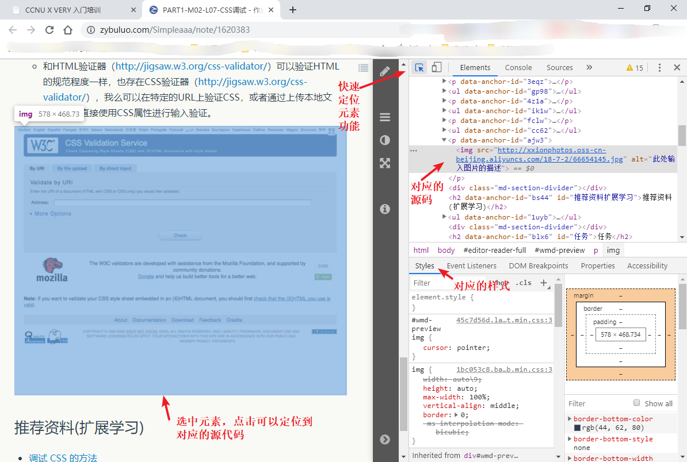
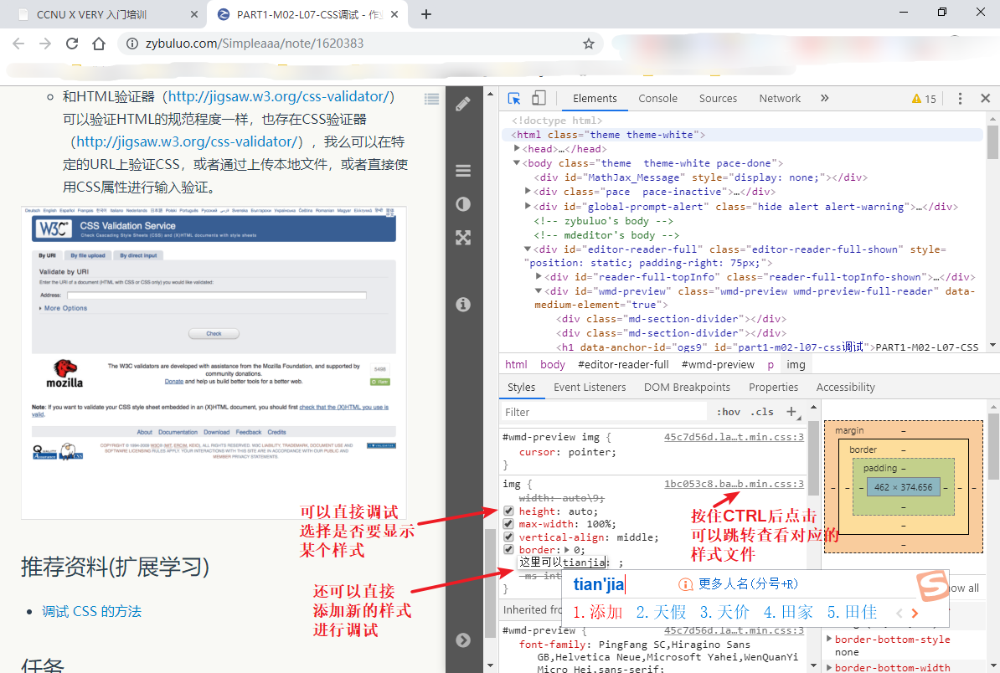
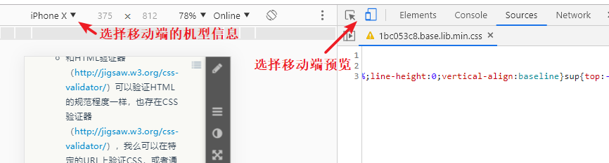

# CSS调试
## 总结通过Chrome DevTools进行页面CSS样式调试的方法
- 快速选中元素    
	在Chrome开发者工具中，可以使用鼠标快速的定位到网页上的元素，查看元素对应的HTML、css代码

- 直接修改元素的样式
	在开发者工具中，选中了网页的元素后，可以在开发者工具面板中查看元素的样式文件，样式信息可以直接在开发者工具中进行增加、删除、修改等操作，方便直接调试。（所有修改都不会映射到原文加上，直接一个调试）
	还可以跳转到对应的样式文件中查看具体的代码

- 移动端预览     

